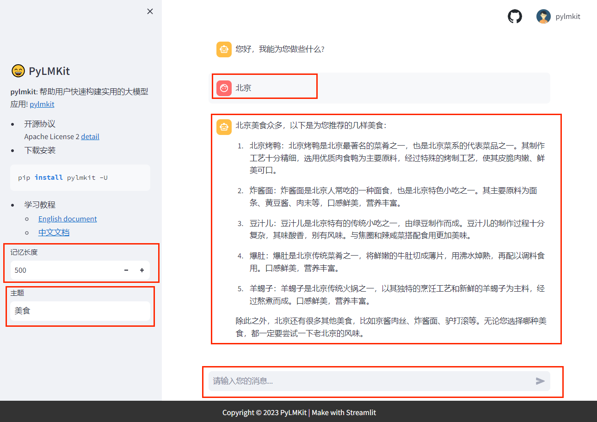

# PyLMKit

**pylmkit** 是一个旨在构建或集成具有实用价值的大模型（LM）应用程序的项目，旨在帮助用户快速、灵活、有针对性地构建符合其业务需求。

# 教程文档
<a href="https://www.yuque.com/txhy/pylmkit" target="_blank">PyLMKit使用教程</a>

# 1.快速安装
```bash
pip install -U pylmkit
```

# 2.功能应用

## 角色扮演
角色扮演：通过设置角色模板并结合在线搜索、记忆和知识库功能，实现了典型的对话类的功能应用。RolePlay角色扮演是一种基础功能，主要作用是建立一个垂直角色的场景，引导大模型往这个角色设定的方向去回答。比如让大语言模型充当`英语翻译员`，在角色模板中我们已经告诉它要做什么事情，因此在接下来的提问只需提问即可，而不需要重复告诉它要怎样去翻译。
```python
我想让你充当英语翻译员、拼写纠正员和改进员。我会用任何语言与你交谈，你会检测语言，翻译它并用我的文本的更正和改进版本用英语回答。我希望你用更优美优雅的高级英语单词和句子替换我简化的 A0 级单词和句子。保持相同的意思，但使它们更文艺。我要你只回复更正、改进，不要写任何解释。
我的第一句话是{query}
```


## RAG
RAG（Retrieval-Augmented Generation，检索增强生成）是一种利用知识库检索的方法，提供与用户查询相关的内容，从而增强模型答案的准确性和特异性。RAG包括本地知识库、基于网络的知识库、记忆知识库和数据库知识库。
**PyLMKit设计了四种RAG功能**

- 基于本地文档的知识库DocRAG
- 基于网页的知识库WebRAG
- 基于数据库的知识库DBRAG
- 基于记忆的知识库MemoryRAG


## 长文本摘要
在一些长篇幅、长文本场景下，由于模型本身或硬件资源受限而无法一次性处理长文本，因此需要通过`分而治之`的思想进行长文本摘要提取。

## 数据库
功能更新中....

## 智能体
功能更新中....

# 3.网页端Web
支持streamlit页面自定义参数交互、对话功能，主要作用用于功能测试和demo演示。

# 4.API
更新中，后面陆续提供功能应用的后端API接口。


# 5.快速开始

`PyLMKit`目前集成了`LLM`模型分为：

- `API`付费调用型
- 本地开源模型下载部署

`LLM`模型有两种调用方式：

- 普通模式：invoke(query)
- 流式模式：stream(query)
## API代理模型
### API KEY配置
**第一种方法**：一个方便的方法是创建一个名称为`.env`文件，并在其中配置所有的API密钥信息，从而方便地使用不同的模型。`.env`文件的格式如下：
```python
openai_api_key = ""  # OpenAI

QIANFAN_AK = ""  # 百度-千帆
QIANFAN_SK = ""

DASHSCOPE_API_KEY = ""  # 阿里-通义

spark_appid = ""  # 科大讯飞-星火
spark_apikey = ""
spark_apisecret = ""
spark_domain = "generalv3"  # generalv2

zhipu_apikey = ""  # 清华-智谱AI

baichuan_api_key = ""  # 百川
baichuan_secret_key = ""

hunyuan_app_id = ""  # 腾讯-混元
hunyuan_secret_id = ""
hunyuan_secret_key = ""
```
**第二种方法**：通过 os.environ 初始化 API KEY。
```python
import os 


os.environ['qianfan_ak'] = ""
os.environ['qianfan_sk'] = ""
os.environ['model'] = "ERNIE-Bot-turbo"

```
### 模型使用
大语言模型使用：其中，`query`表示用户输入内容，样例如下：
```python
import os
from pylmkit.llms import ChatQianfan  # 百度-千帆
from pylmkit.llms import ChatSpark  # 讯飞-星火
from pylmkit.llms import ChatZhipu  # 清华-智谱
from pylmkit.llms import ChatHunyuan  # 腾讯-混元
from pylmkit.llms import ChatBaichuan  # 百川
from pylmkit.llms import ChatTongyi  # 阿里-通义
from pylmkit.llms import ChatOpenAI  # OpenAI
from dotenv import load_dotenv


# 第一种方法：加载 .env 初始化 API KEY
load_dotenv()
# 第二种方法：通过 os.environ 初始化 API KEY
# os.environ['qianfan_ak'] = ""
# os.environ['qianfan_sk'] = ""
# os.environ['model'] = "ERNIE-Bot-turbo"

# 加载模型
model = ChatQianfan()

# 普通模式
res = model.invoke(query="如何学习python？")
print(res)

# 流式模式
res = model.stream(query="如何学习python？")
for i in res:
    print(i)

```
### 对话网页Web
角色扮演应用的样例，文件名为demo.py
```python
from pylmkit import BaseWebUI
from dotenv import load_dotenv
from pylmkit.app import RolePlay
from pylmkit.llms import ChatOpenAI
from pylmkit.memory import MemoryHistoryLength
from pylmkit.llms import ChatQianfan


load_dotenv()
web = BaseWebUI(language='zh')  # 中文网站


model = ChatQianfan(model="ERNIE-Bot-turbo")
memory = MemoryHistoryLength(memory_length=web.param(label="记忆长度", type='int', value=500),  # 添加页面交互参数
                             streamlit_web=True
                            )
role_template = "{memory}\n 请为我推荐{query}的{topic}"
rp = RolePlay(
    role_template=role_template,  # 角色模板
    llm_model=model,  # 大语言模型
    memory=memory,  # 记忆
    online_search_kwargs={},
    # online_search_kwargs={'topk': 2, 'timeout': 20},  # 搜索引擎配置，不开启则可以设置为 online_search_kwargs={}
    return_language="中文"
)

# python运行
# res = rp.invoke(query="广州", topic="美食")
# print(res)

# 网页运行
web.run(
    obj=rp.invoke,
    input_param=[{"name": "query", "label": "地点", "type": "chat"},
                 {"name": "topic", "label": "主题", "type": "text"},
                 ],
    output_param=[{'label': '结果', 'name': 'response', 'type': 'chat'},
                  {'label': '参考', 'name': 'refer', 'type': 'refer'}
                  ]
)
```
然后在该路径下的终端运行下面命令：
```python
streamlit run demo.py
```
默认会打开浏览器网页，也可以通过网址访问： [http://localhost:8501/](http://localhost:8501/)



## 本地部署模型
安装 `modelscope` 依赖包
```bash
pip install modelscope
```
### 开源模型下载
本案例采用一个很小的模型作为例子，让大多数人都能成功运行这个Demo。这个Demo在CPU环境也能成功运行，并且内存占用小，模型名称为 `Qwen/Qwen-1_8B-Chat`，更多模型名称，可以去魔搭社区去找相应的模型，链接：[魔搭社区](https://www.modelscope.cn/models?page=1&tasks=text-generation&type=nlp)
```python
from pylmkit.llms import LocalLLMModel

LocalLLMModel(model_path='Qwen/Qwen-1_8B-Chat',  # 模型名称
              tokenizer_kwargs={"revision": 'master'},  
              model_kwargs={"revision": 'master'},
              language='zh',  # zh 表示使用国内环境下载，速度快
)
```
下载好的效果如下：


**（1）将下载模型及文件拷贝到自己想要的位置**
一般采用上述下载方式，模型都会下载缓存到 `C` 盘，缓存的位置一般在：`C:\Users\你的用户名\.cache\modelscope\hub`，将刚刚下载的`qwen/Qwen-1_8B-Chat`文件夹剪切保存到 `D:/mycode_llm/` （这里举个例子，可以自定义）路径下，主要避免文件太大占满 `C` 盘。

**（2）安装该开源模型的依赖库**
这一步骤很重要，一方面要保证你的`CUDA`环境配置正确、内存足够，即硬件资源得够（当然，CPU环境也可以跑一些模型）；另一方面则需要到开源模型的github或者根据其它教程，安装依赖包和推理加速等依赖文件。
一般在下载的模型文件夹里，会有一个`README.md`文件，这是一个关于模型基本信息和安装的说明书，不懂安装依赖库的同学可以详细参照着这个教程来安装，比如`Qwen/Qwen-1_8B-Chat`文件夹内容截图如下：


这个步骤做好了，下一步骤才能正确运行模型，避免遇到大量BUG，那么这个时候就需要一个一个排查和解决。
### 本地模型部署
```python
from pylmkit.llms import LocalLLMModel


model = LocalLLMModel(
    model_path='D:/mycode_llm/qwen/Qwen-1_8B-Chat',  # 前面保存的模型文件路径
    tokenizer_kwargs={"revision": 'master'},
    model_kwargs={"revision": 'master'},
    language='zh'
)

# 普通模式
res = model.invoke(query="如何学习python？")
print(">>>invoke ", res)

# 流式模式
res = model.stream(query="如何学习python？")
for i in res:
    print(">>>stream ", i)
```
效果如下


### 对话网页Web
角色扮演应用的样例，文件名为demo.py
```python
from pylmkit import BaseWebUI
from dotenv import load_dotenv
from pylmkit.app import RolePlay
from pylmkit.memory import MemoryHistoryLength
from pylmkit.llms import LocalLLMModel


load_dotenv()
web = BaseWebUI(language='zh')  # 中文网站


model = LocalLLMModel(
    model_path='D:/mycode_llm/qwen/Qwen-1_8B-Chat',  # 前面保存的模型文件路径
    tokenizer_kwargs={"revision": 'master'},
    model_kwargs={"revision": 'master'},
    language='zh'
)
memory = MemoryHistoryLength(memory_length=web.param(label="记忆长度", type='int', value=500),  # 添加页面交互参数
                             streamlit_web=True
                            )
role_template = "{memory}\n 请为我推荐{query}的{topic}"
rp = RolePlay(
    role_template=role_template,  # 角色模板
    llm_model=model,  # 大语言模型
    memory=memory,  # 记忆
    online_search_kwargs={},
    # online_search_kwargs={'topk': 2, 'timeout': 20},  # 搜索引擎配置，不开启则可以设置为 online_search_kwargs={}
    return_language="中文"
)

# python运行
# res = rp.invoke(query="广州", topic="美食")
# print(res)

# 网页运行
web.run(
    obj=rp.invoke,
    input_param=[{"name": "query", "label": "地点", "type": "chat"},
                 {"name": "topic", "label": "主题", "type": "text"},
                 ],
    output_param=[{'label': '结果', 'name': 'response', 'type': 'chat'},
                  {'label': '参考', 'name': 'refer', 'type': 'refer'}
                  ]
)
```
然后在该路径下的终端运行下面命令：
```python
streamlit run demo.py
```
默认会打开浏览器网页，也可以通过网址访问： [http://localhost:8501/](http://localhost:8501/)

# 开源协议
Apache License Version 2


